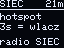
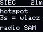

# Biper

**A radio cube a scared person can use.** Two of them and a phone, and two households
have a link that needs no operator, no internet and no subscription. Thirty of them in
one town and the town can hear itself when everything else goes quiet.

This is a product fork of [MeshCore](https://github.com/meshcore-dev/MeshCore).
MeshCore is the mesh. Biper is everything that has to happen so that a sixty-year-old
neighbour, holding the thing for the first time, gets to their first sent message
without reading a manual.

[](../license.txt)
[](https://github.com/meshcore-dev/MeshCore)
[](https://docs.m5stack.com/en/unit/Unit_C6L)
[](#legal-and-radio-boundaries)
[](#how-this-fork-touches-upstream)

> **Status.** The host side works and is gated in CI. The pair works: on
> 20 August 2026 two cubes on this build exchanged direct messages both ways,
> each through its own phone over the cube's Wi-Fi panel — owner-led
> validation on a desk, not a range test. Range, power draw and long-run
> stability remain unmeasured, and this README keeps measured and unmeasured
> apart. The web installer at [esp32ai.me/biper](https://esp32ai.me/biper/)
> ships the current build of this layer (SHA-256 published next to the
> installer and in the release manifest). There is no tagged release and no
> signed artifact in this repository yet. Changes: [CHANGELOG.md](../CHANGELOG.md).

---

## Why this exists

Emergency communication in Poland is something you *receive*. An alert arrives on your
phone, from an operator, over infrastructure that belongs to somebody else. When that
infrastructure is down — a storm, a blackout, a cut fibre — you receive nothing, and
you cannot send anything either.

If your first question is „why MeshCore and not Meshtastic”, it has a
[written answer](https://esp32ai.me/en/biper/project/#dlaczego-meshcore) —
airtime economics in a duty-cycled band, architecture fit, hardware, licence.

Biper is the other direction. The network is made of the people in it. Each cube is
bought by one person for their own reasons, and every cube added extends everybody
else's range. There is no centre to fail and no company to go out of
business. Nobody's permission is required.

That is the whole civic argument, and it has a technical consequence that runs through
this code: **the person holding the cube has to be able to see what it is doing.**
A device that quietly does something other than what its screen says is worse than no
device, because people will make decisions based on it during the worst hour of their
year. Half the commits in this fork are about closing exactly that kind of gap.

## What this fork adds

MeshCore's `companion_radio` gives you a radio that talks to a phone app over
Bluetooth. Everything below is what Biper adds on top, all of it in
[`src/helpers/biper/`](../src/helpers/biper/):

| | |
|---|---|
| **A screen language** | 64 × 48 pixels, one bit deep. Six states, each an animated field rather than a word: at rest the field flows and carries `BIPER`, and its speed is the density of the mesh around you. Ported to the website pixel-for-pixel and kept honest by a gate that compiles the firmware's own drawing functions and diffs the frames. |
| **One button, five gestures** | Click cycles the screen. Double click is silence and darkness. Triple click switches whether the cube relays other people's traffic. Three seconds brings up a Wi-Fi hotspot. Ten seconds wipes the cube, counting down from the fourth second so nobody wipes one by leaning on it. |
| **A relay switch that survives a restart** | Two modes, both named for what they do — `SIEC` (Polish for „network”) carries other people's messages onward; `SAM` („on your own”) transmits only yours. The cube has no battery, so a nudged cable is a reboot — the choice is stored in NVS, and the screen says which mode is on. |
| **A panel served from the cube's own flash** | Hold the button, join the cube's Wi-Fi, and the phone becomes a screen and a keyboard. No account, no app store, no internet. 97 kB of HTML, 36.1 kB (36962 bytes) over the air after gzip. It carries a built-in guide, so the manual is inside the device. |
| **A voice and a light** | Two or three notes per event, never a jingle. One addressable LED whose behaviour is documented next to the code that drives it — including the fact that ninja mode really does go dark, and that the radio keeps transmitting while it does. |
| **Custody of the device** | Origin guard on the WebSocket bridge, a fresh eight-character Wi-Fi password for every hotspot window (31-symbol alphabet chosen to be copyable off a 64 × 48 screen), the pairing PIN visible only inside a pairing window, private-key export compiled out — identity is disposable by design, contacts restore from the panel's local backup — and security headers on everything the cube serves. |

## What the screen actually shows

Not a mock-up. These are rendered by compiling the firmware's own
`draw_network_page()` against a stub display and the same `glcdfont.c` table that gets flashed:

<p>
  
  
</p>

That method found a real bug the day it was written: `radio: SIEC` is eleven
characters, the line holds ten, `setTextWrap(false)` was clipping the last letter,
and nobody had noticed by eye. The fix is a `static_assert` — a literal too wide for
the screen now fails to compile.

## Hardware

One board, deliberately. **M5Stack Unit C6L** (SKU `U202`) — ESP32-C6 with an SX1262,
in a factory enclosure, with a screen and two antenna sockets.

| part | where |
|---|---|
| buzzer | `G11` |
| addressable LED | `G2` |
| user button (`SYS_KEY1`) | `P0` of a PI4IOE5V6408 expander, own I²C bus `SDA G10 / SCL G8`, active low |
| OLED SSD1306 64 × 48 | SPI |
| status LED (green, factory) | wired to power, not driven by us |

The expander also holds the LoRa LNA enable, the antenna switch and the SX1262 reset
line, so [`BiperButton.cpp`](../src/helpers/biper/BiperButton.cpp) writes its
configuration exactly once, in an order that keeps those three pins driven high
throughout. Getting that order wrong resets the radio mid-operation.

## Build

```bash
# full: mesh + BLE + Wi-Fi AP + panel over HTTP
pio run -e Biper_AP_C6L_spike

# USB companion, no BLE
pio run -e Biper_AP_C6L_wifi_only

# after editing the panel — the build does NOT regenerate the asset for you
python3 biper/app/gen-asset.py

# after changing the typography subsets
python3 biper/app/gen-fonts.py
```

```bash
# flash over USB (the cube shows up as a serial port; hold the side button if it does not)
pio run -e Biper_AP_C6L_spike -t upload

# one merged image starting at offset 0x0 — the file a web installer flashes;
# this is exactly what esp32ai.me/biper ships
bash biper/release.sh
```

CI builds both environments on every push, checks that the generated panel
asset matches its source, and re-computes the numbers this README claims — see
[`.github/workflows/biper-build.yml`](workflows/biper-build.yml).

## Repository map

| path | what it is |
|---|---|
| [`src/helpers/biper/`](../src/helpers/biper/) | the Biper layer: screen, button, feedback, hotspot, panel bridge |
| [`variants/biper_ap/`](../variants/biper_ap/) | PlatformIO environments and the C6L target |
| [`biper/app/`](../biper/app/) | the panel served from flash — source HTML plus the asset/font generators |
| [`biper/WIKI-C6L.md`](../biper/WIKI-C6L.md) | measured hardware facts for the Unit C6L, with statuses |
| [`biper/release.sh`](../biper/release.sh) | builds the merged release image and prints its SHA-256 |
| [`CHANGELOG.md`](../CHANGELOG.md) | what shipped and what changed |

Both environments are additive: they live in
[`variants/biper_ap/platformio.ini`](../variants/biper_ap/platformio.ini), which the
root `extra_configs` wildcard picks up, so no upstream configuration file is edited to
add them. `huge_app` partitions, because mesh + BLE + Wi-Fi + HTTP does not fit the
stock app slot.

## How this fork touches upstream

This is the part a reviewer should check first.

```
51 files changed, 12951 insertions(+), 360 deletions(-)   # vs MeshCore companion-v1.17.1, as of 20 Aug 2026
```

Of those lines  about 7 000 sit in two generated headers — the gzipped panel
asset and the OFL font data  rebuilt by `gen-asset.py` and `gen-fonts.py`; the
hand-written remainder is about 4 900 lines  the panel's own HTML source
included. Measured, not remembered — reproduce it yourself:

```bash
git remote add upstream https://github.com/meshcore-dev/MeshCore
git fetch upstream --tags
git diff --shortstat companion-v1.17.1 HEAD
git diff --numstat  companion-v1.17.1 HEAD -- examples/companion_radio/main.cpp
```

Upstream is touched in thirteen files, and each kind is easy to audit.
`examples/companion_radio/main.cpp`, **+94 / −0**, in four blocks that announce
themselves:

```cpp
// ---- BIPER_AP hook: … ----
   …
// ---- end BIPER_AP hook ----
```

Deleted: upstream's `CNAME` and `FUNDING.yml` (a fork must not claim the
upstream project's Pages domain or route funding meant for upstream) and six of
upstream's release/CI workflows — they build and publish artifacts this fork
does not ship. Rewritten for this fork: `CONTRIBUTING.md` and `SECURITY.md`.
Extended: `.gitignore` and `license.txt` (one added copyright line for the
Biper layer). Everything else is new files under `src/helpers/biper/`,
`variants/biper_ap/`, `biper/` and `fonts/`. Nothing upstream is renamed or
reformatted, and no upstream source file is edited beyond `main.cpp`.
Rebasing onto a new MeshCore release means resolving one file.

## What is measured and what is not

**Measured**, on the bench, this repository:

- both environments compile; flash 71.1 %, RAM 32.9 %
- the radio entropy source is alive — five boots, 28–31 distinct values out of 32
  samples, 111–130 bits set out of 256, samples different every time (expected ≈ 30.2
  and 128 ± 8)
- the panel is served, gzipped, and the expander is found at `0x43`

**Not measured**, and therefore not claimed: range, power draw, battery behaviour,
BLE against every phone, screen readers, and the whole of on-air behaviour under load.
A `PASS` from a host gate is a statement about a host, and this repository never lets
one pretend to be a statement about a device. The thirty-cube town in the first
paragraph is the thesis this project exists to test, not a measurement.

## How this was built

A large part of this code was written with an AI assistant, and the review
discipline in this repository exists because of that, not despite it: every claim
carries the command that reproduces it, host gates never speak for devices, and
the generated headers are diffed in CI. A model is fast at producing plausible
code and equally fast at producing plausible measurements — so nothing here is
believed until something re-runs it. Hardware decisions, the product line, and
every measured mark are the author's.

## Legal and radio boundaries

- 868 MHz is a licence-free band **with conditions** — duty cycle, ERP, channel plan.
  Those conditions are the operator's responsibility, and they differ by country.
  Nothing here grants permission to transmit.
- The shared channel key is in open source. **Anyone with a cube like this can read
  the shared channel, and anyone can write on it under any name.** Private messages
  between two known nodes are a different path and are encrypted; the shared channel
  is a village square, and the product says so out loud.
- Radio can be located. Always. A device that transmits can be found by somebody who
  wants to find it, and no mode in this firmware changes that.

## Standing on

- [MeshCore](https://github.com/meshcore-dev/MeshCore) by the MeshCore developers — the
  mesh, the routing, the companion protocol. MIT.
- [TheRealHaoLiu/MeshCore](https://github.com/TheRealHaoLiu/MeshCore), branch
  `main-m5stack-unit-c6l` — the working C6L reference that saved us the expander
  bring-up. MIT.
- [Atkinson Hyperlegible](https://www.brailleinstitute.org/freefont) by the Braille
  Institute — the typeface of the panel, chosen because legibility for people with low
  vision is not a nice-to-have in an emergency tool. OFL 1.1.
- [RadioLib](https://github.com/jgromes/RadioLib), Adafruit GFX and SSD1306 libraries.

## Licence

**Our code is MIT**, same as upstream — `SPDX-License-Identifier: MIT`,
`Copyright (c) 2026 Tomasz Fiedoruk`.

**The embedded font data is not.** `src/helpers/biper/BiperFontAsset.h` holds
~97 kB of three typefaces under **OFL 1.1**, and the firmware redistributes them
over `/f/*.woff2`. OFL is explicit that they may not be relicensed — if you fork
this fork, that file keeps its own terms. Details in
[`fonts/README.md`](../fonts/README.md).

**Third-party libraries keep their own licences**: RadioLib (MIT), Adafruit GFX
and SSD1306 (BSD), and ESP-IDF's `esp_http_server` (Apache-2.0), which serves the
panel.

---

**Biper is a community project by Tomasz Fiedoruk** — [esp32ai.me/biper](https://esp32ai.me/biper/)
· [fiedoruk.pl](https://fiedoruk.pl)

*Upstream's own README, describing MeshCore itself, is at
[`README.md`](../README.md).*
